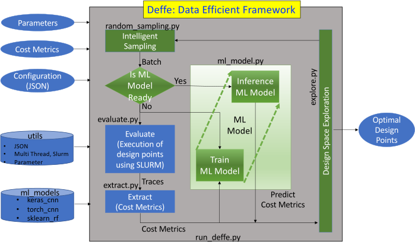

# Deffe: Data-Efficient Framework for Exploration
This repository has the sources for Deffe framework, which is intended
for design space exploration with exploration and machine learning
based prediction capabilities. The technical details of Deffe is explained in the [reference, see below][1]. The state of the art design space
exploration tools evaluate the design points (samples) and identify
the optimal design points based on the cost metrics. However, the
evaluation of design points are time consuming and may require heavy
computation for some problems. Deffe will help for such problems.

Deffe's machine learning model tries to learn from the evaluated
design points. Once after learning for some time, Deffe's machine
learning model inference can predict the cost metrics with ~98%
accuracy, which can be used for fast design space exploration. It
needs less than 5% of the samples to get the near-accurate machine
learning prediction model and can save huge time in the design space
exploration.

Deffe framework is implemented fully in python and it is configured
through json file. The json file has configuration of problem with
parameters, cost metrics, evaluate procedure, prediction method,
sampling technique and exploration algorithm. It provides great
flexibility to users to add their custom python modules for the above
tasks.

## Reference
[1]: Frank Liu, Narasinga Rao Miniskar, Dwaipayan Chakraborty and Jeffrey S. Vetter, "Deffe: a data-efficient framework for performance characterization in domain-specific computing", ACM International Conference on Computing Frontiers (CF 2020), May 2020, Catania, Italy, https://doi.org/10.1145/3387902.3392633

## Deffe framework component diagram


The above figures shows the main blocks and their corresponding python files in the Deffe framework.

## Hardware Dependencies 
1. GPU to train the machine learning model
2. SLURM environment if to run evaluate (RISCV-GEM5) simulations
    - Installation of GEM5 is given in http://learning.gem5.org/book/part1/building.html

## Software Dependencies
1. Python-3
2. Graphviz 
3. Python packages
    - keras 
    - tensorflow 
    - tensorflow-gpu 
    - torch
    - doepy
    - scikit-learn 
    - xlsxwriter 
    - matplotlib 
    - pandas 
    - pathlib
    - pydot 
    - tqdm 
    - multiprocess
    - torchsummary
    - commentjson
    - jsoncomment
    ```bash
    Install all required packages from requirements.txt file in the repository.
    $ pip3 install -r requirements.txt

    Or

    $ python3 -m pip install keras tensorflow torch doepy scikit-learn xlsxwriter matplotlib pandas pathlib pydot tqdm torchsummary jsoncomment commentjson multiprocess
    ```

## Docker support
Docker support is provided for Deffe. Set proxy settings in Docker file and also in apt.conf file appropriately.
```bash
$ make -f Makefile.docker build ; 
$ make -f Makefile.docker run ;
```

## How to run Deffe?
An example Deffe configuration for RISCV design space exploration along with their associated files are placed in <b>example</b> directory. 
```bash
$ source setup.source
$ cd example ; 
$ python3 ../framework/run_deffe.py -config config_small.json
$ cd .. ;
```
A bare minimal simple two parameters and one application test case is available in test directory. 
```bash
$ source setup.source
$ cd test; 
$ sh run_deffe.sh
$ cd .. ;
```

An example Deffe configuration for RISCV design space exploration (without slurm) along with their associated files are placed in <b>example</b> directory. 
```bash
$ source setup.source
$ cd example ; 
$ python3 ../framework/run_deffe.py -config config_small.json -no-slurm
$ cd .. ;
```

The run_deffe.py file can show all command line options with the below command.
```bash
$ cd example ;
$ python3 ../framework/run_deffe.py -h
$ cd .. ;
```

To run the exploration on the preloaded data
```bash
$ cd example ;
$ python3 ../framework/run_deffe.py -config config_small.json \
   -only-preloaded-data-exploration -step-start 0 -step-end 1 \
   -epochs 100 -batch-size 256 
$ cd .. ;
```

To run full exploration (all samples at once training, means no transfer learning across samples) on the pre-evaluated/pre-loaded data
```bash
$ cd example ;
$ python3 ../framework/run_deffe.py -config config_small.json \
  -only-preloaded-data-exploration -full-exploration -train-test-split 0.7 \
  -validation-split 0.23 -step-start 0 -step-end 1 -epochs 100 -batch-size 256 
$ cd .. ;
```

## How to run experiments?
### Run Deffe with K-means with pre-evaluated complete dataset given to model train
```bash
* Dataset: examples/output_kmeans_deffe.csv
* Config file: examples/config_kmeans.json
* Loss functions: custom_mean_abs_log_loss (default) or custom_mean_abs_exp_loss 
*  (exponential loss function)
* Run directory: example/experiments/full_explore/log/kmeans   (For log loss function)
                 example/experiments/full_explore/exp/kmeans   (For exponential loss function)
* Command to run: 
    $ source setup.source
    $ cd example/experiments/full_explore/log/kmeans 
    $ python3 $DEFFE_DIR/framework/run_deffe.py \
    -config $DEFFE_DIR/example/config_kmeans.json \
    -only-preloaded-data-exploration -epochs 20000 -batch-size 4096 \
    -full-exploration \
    -train-test-split 0.7 -validation-split 0.23 -loss custom_mean_abs_log_loss

* Command to generate stats. It will load the same training and testing indices used for ML model 
    $ python3 $DEFFE_DIR/framework/run_deffe.py \
    -model-extract-dir checkpoints -config $DEFFE_DIR/example/config_kmeans.json \
    -only-preloaded-data-exploration -train-test-split 0.7 \
    -validation-split 0.23 -load-train-test -loss custom_mean_abs_exp_loss \
    -model-stats-output test-output-exploss.csv

* Output files: 
    ** Intermediate checkpoint files directory: example/experiments/full_explore/log/kmeans/checkpoints
    ** Training and Test indexes used: step<int>-train-indices.npy, step<int>-val-indices.npy, 
    ** which have training and validation indexes used for training for that step
    ** Output statistics in file: test-output-exploss.csv in the format (Epoch, TrainLoss, 
    ** ValLoss, TestLoss, Step, TrainCount, ValCount)
* Try sample parameters:
    ** Input test-input.csv
    ** Command given below
       $ python3 $DEFFE_DIR/framework/run_deffe.py \
       -config $DEFFE_DIR/example/config_kmeans.json \
       -input test-model.csv -icp kmeans.hdf5 -output output-prediction.csv -inference-only
    ** Output test-output.csv
    ** Input ../../../../output_kmeans_deffe.csv 
    ** Command given below
       $ python3 $DEFFE_DIR/framework/run_deffe.py \
       -config $DEFFE_DIR/example/config_kmeans.json \
       -icp kmeans.hdf5  -input ../../../../output_kmeans_deffe.csv  \
       -output test-output-full.csv \ -inference-only
    ** Output test-output-full.csv
```

### Run Deffe with K-means with pre-evaluated data set but passed as set of samples and enabled transfer learning across samples
```bash
* Dataset: examples/output_kmeans_deffe.csv
* Config file: examples/config_kmeans_tl_samples.json
* Loss functions: custom_mean_abs_log_loss (default) or custom_mean_abs_exp_loss 
* (exponential loss function)
* Run directory: example/experiments/transfer_learning_samples/log/kmeans   (For log loss function)
                 example/experiments/transfer_learning_samples/exp/kmeans   (For exponential loss function)
* Command to run: 
    $ source setup.source
    $ cd example/experiments/transfer_learning_samples/log/kmeans 
    $ python3 $DEFFE_DIR/framework/run_deffe.py \
    -config $DEFFE_DIR/example/config_kmeans_tl_samples.json \
    -only-preloaded-data-exploration -epochs 1000 -batch-size 256 \
    -train-test-split 1.0 -validation-split 0.23 

* Command to generate stats. It will load the same training and testing indices used for ML model 
    $ python3 $DEFFE_DIR/framework/run_deffe.py \
    -model-extract-dir checkpoints \
    -config $DEFFE_DIR/example/config_kmeans.json  \
    -only-preloaded-data-exploration \
    -train-test-split 1.0 -validation-split 0.23 \
    -load-train-test -loss custom_mean_abs_exp_loss \
    -model-stats-output test-output-exploss.csv
    $ python3 $DEFFE_DIR/framework/run_deffe.py \
    -model-extract-dir checkpoints \
    -config $DEFFE_DIR/example/config_kmeans.json  \
    -only-preloaded-data-exploration \
    -train-test-split 1.0 -validation-split 0.23 \
    -load-train-test -loss custom_mean_abs_log_loss \
    -model-stats-output test-output-logloss.csv

* Output files: 
    ** Intermediate checkpoint files directory: 
    **    example/experiments/transfer_learning_samples/log/kmeans/checkpoints
    ** Training and Test indexes used: step<int>-train-indices.npy, step<int>-val-indices.npy, 
    ** which have training and validation indexes used for training for that step
    ** Output statistics in file: test-output.csv in the format (Epoch, TrainLoss, ValLoss, 
    ** TestLoss, Step, TrainCount, ValCount)
* Try sample parameters:
    ** Input test-input.csv
    ** Command given below
       $ python3 $DEFFE_DIR/framework/run_deffe.py \
       -config $DEFFE_DIR/example/config_kmeans_tl_samples.json \
       -input test-model.csv \
       -icp kmeans.hdf5 -output output-prediction.csv -inference-only
    ** Output test-output.csv
    ** Input ../../../../output_kmeans_deffe.csv 
    ** Command given below
       $ python3 $DEFFE_DIR/framework/run_deffe.py \
       -config $DEFFE_DIR/example/config_kmeans_tl_samples.json -icp kmeans.hdf5  \
       -input ../../../../output_kmeans_deffe.csv  -output test-output-full.csv \
       -inference-only
    ** Output test-output-full.csv
```

### Run Deffe with Matmul with pre-evaluated data set but passed as set of samples and enabled transfer learning across samples and also enabled transfer learning from kmeans. 
```bash
* Dataset: examples/output_matmul_deffe.csv
* Frozen layers: 2 convolution layers
* Config file: examples/config_matmul_tl_samples.json
* Loss functions: custom_mean_abs_log_loss (default) or custom_mean_abs_exp_loss 
* (exponential loss function)
* Run directory: example/experiments/transfer_learning_samples_across_kernels/log/matmul 
*                               (For log loss function)
*                example/experiments/transfer_learning_samples_across_kernels/exp/matmul  
*                               (For exponential loss function)
* Command to run: 
    $ source setup.source
    $ cd example/experiments/transfer_learning_samples_across_kernels/log/matmul 
    $ python3 $DEFFE_DIR/framework/run_deffe.py \
    -config $DEFFE_DIR/example/config_matmul_tl_samples.json -icp ../../kmeans.hdf5 \
    -only-preloaded-data-exploration -epochs 1000 -batch-size 256 -train-test-split 1.0 \
    -validation-split 0.23 

* Command to generate stats. It will load the same training and testing indices used for ML model 
    $ python3 $DEFFE_DIR/framework/run_deffe.py \
    -model-extract-dir checkpoints \
    -config $DEFFE_DIR/example/config_matmul.json  \
    -only-preloaded-data-exploration \
    -train-test-split 1.0 -validation-split 0.23 -load-train-test \
    -loss custom_mean_abs_exp_loss -model-stats-output test-output-exploss.csv

    $ python3 $DEFFE_DIR/framework/run_deffe.py -model-extract-dir checkpoints \
    -config $DEFFE_DIR/example/config_matmul.json  -only-preloaded-data-exploration \
    -train-test-split 1.0 -validation-split 0.23 -load-train-test \
    -loss custom_mean_abs_log_loss -model-stats-output test-output-logloss.csv

* Output files: 
    ** Intermediate checkpoint files directory: 
    **     example/experiments/transfer_learning_samples_across_kernels/log/matmul/checkpoints
    ** Training and Test indexes used: step<int>-train-indices.npy, step<int>-val-indices.npy, 
    ** which have training and validation indexes used for training for that step
    ** Output statistics in file: test-output.csv in the format (Epoch, TrainLoss, ValLoss,
    ** TestLoss, Step, TrainCount, ValCount)
* Try sample parameters:
    ** Input test-input.csv
    ** Command given below
       $ python3 $DEFFE_DIR/framework/run_deffe.py \
       -config $DEFFE_DIR/example/config_matmul_tl_samples.json -icp matmul.hdf5 \
       -input test-input.csv -output test-output.csv -inference-only
    ** Output test-output.csv
    ** Input ../../../../output_matmul_deffe.csv 
    ** Command given below
       $ python3 $DEFFE_DIR/framework/run_deffe.py \
       -config $DEFFE_DIR/example/config_matmul_tl_samples.json -icp matmul.hdf5  \
       -input ../../../../output_matmul_deffe.csv  -output test-output-full.csv \
       -inference-only
    ** Output test-output-full.csv

```

### Bash scripts in the below directories to run above configurations
```bash
example/experiments/transfer_learning_samples/exp/kmeans/run.sh
example/experiments/transfer_learning_samples/log/kmeans/run.sh
example/experiments/transfer_learning_samples_across_kernels/exp/matmul/run.sh
example/experiments/transfer_learning_samples_across_kernels/log/matmul/run.sh
example/experiments/full_explore/exp/kmeans/run.sh
example/experiments/full_explore/log/kmeans/run.sh
```

## How to extend Deffe?
All classes in Deffe have the below bare minimal methods.
```python
import os
import argparse
import shlex

class DeffeExploration:
    def __init__(self, framework):
        self.config = framework.config.GetExploration()
        self.framework = framework

    # Initialize the members
    def Initialize(self):
        None

    def Run(self):
        None

def GetObject(framework):
    obj = DeffeExploration(framework)
    return obj
```

The "GetObject" method returns the object of the class. It should take the Deffe framework object as an input to configure the class. The class will have "Initialize" and "Run" method. 


## How to configure JSON configuration?
An example JSON configuration file parameters are shown in short given below.
```
{
    "python_path" : ["."],
    "knobs" : 
        [
            ### Array of Knobs (Architecture / Application Knobs) ###
        ],
    "scenarios" : 
        [
            ### Array of Scenarios (Application scenarios) ###
        ],
    "costs" : 
        [ 
            ### Array of Cost metric names ###
        ],
    "model" : {
            ### ML-Model JSON key-value configuration parameters ###
    },
    "exploration" : {
            ### Exploration (DSE) module json key-value configuration parameters ###
    },
    "sampling" : {
            ### Intelligent sampling (Random) module JSON key-value configuration parameters ###
    },
    "evaluate" : {
            ### Evaluate (Sampling points evaluation) module json key-value configuration parameters ###
    },
    "extract" : {
            ### Extract (evaluation output extraction) module json key-value configuration parameters ###
    },
    "framework" : {
            ### Framework  module json key-value configuration parameters ###
    },
    "slurm" : {
            ### Slurm json key-value configuration parameters ###
    }
}
```


